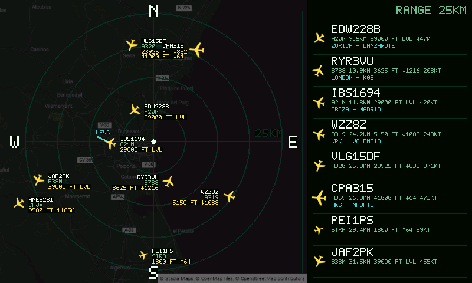
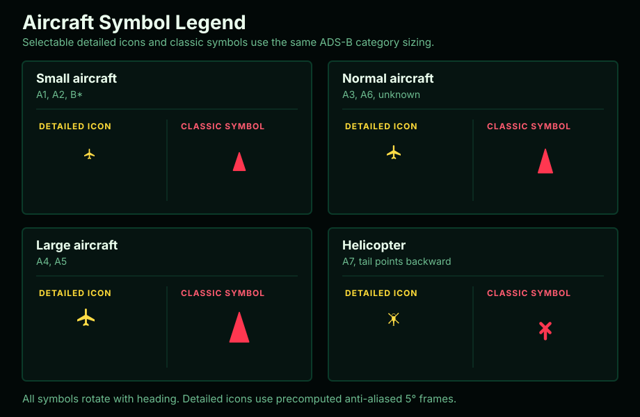

# Big Plane Radar

[English version](README.md)

Прошивка для дисплея Waveshare ESP32-S3-Touch-LCD-7. Показывает живой ADS-B
радар вокруг заданной точки: самолёты, подписи, высоту, вертикальную скорость,
кольца дальности и компактный список бортов справа.

Проект не использует LVGL. Интерфейс рисуется напрямую в RGB565 framebuffer, а
для 800x480 RGB LCD и тача GT911 используется официальный стек Waveshare
`ESP32_Display_Panel`.



## Быстрый старт (рекомендуемый способ)

Это самый простой способ установить Big Plane Radar на новый дисплей. Arduino
IDE, `arduino-cli`, Python и `esptool` не нужны.

### Что понадобится

- Waveshare ESP32-S3-Touch-LCD-7;
- USB-кабель с передачей данных, а не кабель только для зарядки;
- компьютер с Windows, macOS или Linux и Google Chrome либо Microsoft Edge;
- сеть Wi-Fi 2,4 ГГц и пароль от неё. ESP32-S3 не подключается к сети только на
  5 ГГц;
- по желанию API-ключ Stadia Maps, если нужна карта под радаром.

Телефон, планшет, Safari и Firefox для браузерной прошивки не подходят: в них
нет необходимой поддержки Web Serial.

### 1. Подключите дисплей

1. Отключите дисплей от USB.
2. Переведите маленький переключатель выбора UART на плате в положение `UART1`.
3. Подключите USB-кабель к разъёму дисплея с надписью `UART1` или
   `USB TO UART`. Не используйте соседний разъём native USB.
4. Подключите второй конец кабеля к компьютеру.

### 2. Установите прошивку из браузера

1. Откройте в Chrome или Edge
   **[Big Plane Radar Web Installer](https://k4m454k.github.io/big_plane_radar/web-installer/)**.
2. Нажмите **Install Big Plane Radar**, затем **Connect**.
3. Выберите в списке новое USB serial-устройство. Обычно оно называется
   `USB Serial`, `CH343`, `wchusbserial` или похоже.
4. Подтвердите установку и дождитесь 100%. Не отключайте кабель во время
   прошивки.
5. Разрешите очистку устройства, если установщик спросит. Сейчас установщик
   записывает полный merged-образ размером 16 МБ, поэтому считайте браузерную
   установку полной перепрошивкой: Wi-Fi и настройки радара может понадобиться
   ввести заново.
6. Если дисплей не перезапустился автоматически, один раз нажмите `RESET`.

### 3. Подготовьте ключ карты (необязательно)

Радар работает и без карты. Если нужен обычный чёрный фон, пропустите этот шаг
и при настройке выберите `None`.

Чтобы включить карту, сделайте следующее до подключения компьютера к setup-сети
дисплея:

1. [Создайте аккаунт Stadia Maps](https://client.stadiamaps.com/signup/).
2. Откройте [личный кабинет Stadia Maps](https://client.stadiamaps.com/).
3. Откройте **Manage Properties**, найдите **Authentication Configuration** и
   сгенерируйте API key.
4. Прошивка использует обычные растровые тайлы, доступные на бесплатном плане
   Stadia Maps. Платная подписка на Static Maps не требуется.
5. Оставьте ключ под рукой для следующего шага. Не публикуйте его в скриншотах
   или коммитах.

### 4. Настройте радар

1. Дождитесь, пока дисплей создаст Wi-Fi сеть `PlaneRadar-Setup`.
2. Подключите компьютер или телефон к `PlaneRadar-Setup`. Пароля у сети нет.
3. Если страница настройки не открылась сама, откройте
   **[http://192.168.4.1](http://192.168.4.1)**.
4. Введите название и пароль своей сети Wi-Fi 2,4 ГГц.
5. Укажите свой дом как центр радара. Нажмите **Use browser location** или
   вставьте широту и долготу в десятичном формате из приложения с картами.
6. Для обычного фона оставьте **Map background** равным `None`. Для карты
   выберите `Stadia Alidade Smooth Dark` и вставьте API-ключ из шага 3.
7. Для первого запуска остальные настройки можно не менять.
8. Нажмите **Save and reboot**.

Исчезновение сети `PlaneRadar-Setup` после **Save and reboot** — это нормально:
дисплей переключается на вашу домашнюю сеть Wi-Fi.

Если **Use browser location** не загружается при подключении к
`PlaneRadar-Setup`, введите координаты вручную. Позже их можно изменить через
`http://plane-radar.local`, когда дисплей и компьютер подключены к вашей обычной
сети Wi-Fi.

При первом запуске с картой дисплей скачивает XYZ-тайлы для четырёх масштабов.
Не отключайте питание и дождитесь, пока `TILE CACHE` завершит вид `4/4`: после
этого радар откроется сам. Boot log показывает вид, XYZ-координаты, zoom,
размеры PNG, прогресс скачивания и время декодирования.

### Обычное управление

- тап по радару меняет дальность;
- тап по самолёту в правом списке включает или выключает его трек;
- длинное нажатие на экран снова открывает setup portal;
- настройки можно изменить с устройства в той же Wi-Fi сети по адресу
  [http://plane-radar.local](http://plane-radar.local).

### Если что-то не работает

- **Установщик не видит дисплей:** используйте Chrome или Edge на компьютере,
  проверьте переключатель и кабель в `UART1`, попробуйте другой data-кабель,
  закройте serial terminal и переподключите USB.
- **Serial-устройство вообще не появилось:** на плате установлен USB-UART чип
  CH343. Установите официальный [драйвер WCH для macOS](https://www.wch-ic.com/downloads/CH341SER_MAC_ZIP.html)
  или [драйвер WCH для Windows](https://www.wch-ic.com/downloads/CH343SER_EXE.html),
  затем переподключите плату. В современных Linux драйвер обычно уже есть.
- **Linux видит порт, но установщик не может его открыть:** добавьте пользователя
  в группу `dialout` командой `sudo usermod -aG dialout "$USER"`, выйдите из
  системы и войдите снова.
- **Сеть `PlaneRadar-Setup` не появилась:** нажмите `RESET`, дождитесь boot
  sequence и удерживайте палец на экране, когда нижняя строка попросит открыть
  setup.
- **`plane-radar.local` не открывается:** найдите IP дисплея в интерфейсе роутера
  и откройте его, например `http://192.168.1.123`.
- **На boot-экране написано `NO KEY`:** выбрана карта Stadia без рабочего
  API-ключа. Снова откройте настройки и добавьте ключ либо выберите `None`.
- **Радар пустой:** проверьте Wi-Fi и координаты, затем тапом по радару выберите
  больший радиус.

Официальная документация платы доступна в
[Waveshare wiki](https://docs.waveshare.com/ESP32-S3-Touch-LCD-7).

## 3D-печатный стенд

Подходящий настольный стенд для этого дисплея и прошивки доступен на MakerWorld:

https://makerworld.com/ru/models/3034679-stand-for-esp32-s3-touch-lcd-7-for-plane-radar

## Железо

- Waveshare ESP32-S3-Touch-LCD-7, RGB LCD 800x480
- USB-кабель с передачей данных, подключенный в порт `UART1`
- Переключатель на плате должен стоять в положении `UART1`

На macOS может понадобиться USB serial driver, если плата не появляется как
`/dev/cu.usbmodem*` или `/dev/cu.wchusbserial*`. На Linux устройство обычно
появляется как `/dev/ttyACM*` или `/dev/ttyUSB*`; пользователю может понадобиться
доступ к группе `dialout`.

## Возможности

- setup portal при первом запуске: `PlaneRadar-Setup`;
- сохранение Wi-Fi, центра радара, единиц измерения, отображения аэропортов,
  режима символов, состава подписей, яркости карты и дальности в NVS;
- автоматический выбор от одного до трёх ближайших средних/крупных аэропортов со
  всеми их физическими ВПП;
- данные ADS-B из `https://opendata.adsb.fi/api/v3/`;
- локальное предсказание позиции между ADS-B обновлениями раз в 5 секунд с
  непрерывной перерисовкой;
- до 10 минут подтверждённых координат каждого самолёта хранится в PSRAM; тап по
  строке включает или выключает его трек, а прогнозный последний сегмент
  остаётся временным и никогда не записывается в историю;
- опциональная строка маршрута город-город динамически заполняется через
  кэшируемые callsign-запросы к `https://api.adsbdb.com/`; глобального
  справочника городов в прошивке нет;
- опциональная подложка из растровых тайлов Stadia Maps `Alidade Smooth Dark`,
  доступных на Free-плане, с полноценным режимом без карты;
- настраиваемая яркость карты от 20% до 100%;
- все четыре масштаба карты загружаются один раз при старте и кэшируются в PSRAM,
  поэтому переключение дальности больше не вызывает запросов к Stadia;
- загруженные карты уменьшаются с билинейной фильтрацией для более гладких дорог
  и границ;
- при загруженной карте самолёты используют всю прямоугольную область подложки,
  а цели за её пределами становятся точками на краях; без карты сохраняется
  прежняя круговая граница радара;
- каждая строка подписи самолёта получает отдельную компактную чёрную подложку,
  не закрывающую лишнюю часть карты;
- callsign, тип самолёта, высоту и вертикальную скорость можно независимо
  включать и выключать; оставшиеся строки автоматически сдвигаются без пробелов;
- можно выбрать сглаженные детализированные иконки или прежние классические
  треугольники и символы вертолётов; оба варианта показаны на setup-странице;
- детализированные иконки одинаково используются на карте и в правом списке;
  варианты поворота с шагом 5 градусов заранее хранятся во flash и смешиваются
  с RGB565 framebuffer по альфа-каналу;
- фоновый реконнект к Wi-Fi после отключений питания или позднего старта роутера;
- управление тачем: тап по радару меняет дальность, тап по строке самолёта
  включает или выключает его трек, длинное нажатие открывает setup portal;
- boot setup window: удержание экрана во время запуска принудительно открывает
  setup portal;
- endpoint для скриншота: `/screenshot` и `/screenshot.bmp`;
- консервативные настройки RGB LCD для этой панели: PCLK `13 MHz` и RGB bounce
  buffer `800 * 10`.

## Легенда символов

Символы используют ADS-B поле `category`, если оно есть в ответе. В обоих
режимах применяются одинаковые три размерных класса самолётов и определение
вертолётов. Легенда ниже сравнивает оба варианта.



## Структура

```text
.
├── assets/
│   └── icons/
├── big_plane_radar.ino
├── build_arduino_cli.sh
├── esp_panel_board_custom_conf.h
├── location.html
├── lib/
│   ├── ArduinoJson/
│   └── PNGdec/
├── releases/
├── scripts/
│   ├── build_aircraft_icons.py
│   └── update_airport_data.py
├── src/
│   ├── aircraft_icon_data.inc
│   ├── aircraft_icons.cpp
│   ├── aircraft_icons.h
│   ├── airport_catalog.h
│   ├── map_background.cpp
│   ├── map_background.h
│   ├── main.cpp
│   ├── panel_display.cpp
│   └── panel_display.h
└── vendor/
    └── waveshare-libraries/
```

В `vendor/waveshare-libraries` лежат только нужные Arduino-библиотеки:
`ESP32_Display_Panel`, `ESP32_IO_Expander` и `esp-lib-utils`. LVGL не нужен.

Сгенерированный атлас иконок уже хранится в репозитории, поэтому Pillow не нужен
для обычной сборки. Для пересборки после изменения исходных PNG нужен Pillow
(`python3 -m pip install Pillow`):

```sh
python3 scripts/build_aircraft_icons.py
```

## Данные аэропортов

Сгенерированный каталог содержит только аэропорты и ВПП. Города маршрутов
динамически приходят из ADSBdb и кэшируются в RAM, а setup-страница выбирает для
карты только один-три ближайших аэропорта. Обычному пользователю ничего
генерировать вручную не нужно.

Полная [инструкция по данным и генерации аэропортов](docs/AIRPORT_DATA.ru.md).
[English version](docs/AIRPORT_DATA.md).

## Сборка из исходников (для разработчиков)

Всё ниже нужно только для изменения или самостоятельной сборки прошивки. Для
обычной установки используйте быстрый старт с браузерным установщиком выше.

### Установка инструментов

Нужно установить:

- `arduino-cli`
- Arduino core `esp32:esp32`
- `esptool` для ручной прошивки и диагностики

Установка ESP32 core:

```sh
arduino-cli core update-index
arduino-cli core install esp32:esp32
```

### Сборка

Релизная прошивка собирается с закреплённым high-performance SDK Espressif для
стабильной работы RGB-панели:

```sh
bash build_arduino_highperf.sh
```

При первом запуске скрипт скачает и проверит Espressif SDK `3.2.0-h` размером
около 343 МБ и установит отдельное окружение Arduino Core 3.2.0 в пользовательский
кэш. Системный Arduino Core не заменяется. В сборке включены O2, XIP из PSRAM,
cache line 64 байта и Octal PSRAM 80 МГц.

Для разработки с системным Arduino Core используйте `bash build_arduino_cli.sh`.

По умолчанию используется `LOG_LEVEL=info`: в Serial остаются только ошибки и
важные однократные события. Для диагностики загрузки, сети, карты и времени
отрисовки соберите debug-вариант:

```sh
LOG_LEVEL=debug bash build_arduino_highperf.sh
```

Доступные уровни: `off`, `error`, `info` и `debug`. Отключённые логи приложения
удаляются во время компиляции, а build-скрипт также снижает уровень внутренних
логов ESP32 core.

По умолчанию Wi-Fi логин и пароль в прошивку не вшиваются. Центр радара по
умолчанию — Лондон:

```text
Latitude:  51.507400
Longitude: -0.127800
```

Координаты можно переопределить при сборке:

```sh
DEFAULT_LAT=51.507400 \
DEFAULT_LON=-0.127800 \
bash build_arduino_highperf.sh
```

Опционально можно вшить Wi-Fi defaults:

```sh
DEFAULT_WIFI_SSID="YourNetwork" \
DEFAULT_WIFI_PASSWORD="YourPassword" \
bash build_arduino_highperf.sh
```

По умолчанию подложка карты отключена. Для приватной сборки, в которой Stadia
будет включена при первом запуске:

```sh
DEFAULT_MAP_PROVIDER=stadia \
DEFAULT_STADIA_API_KEY="YourStadiaApiKey" \
bash build_arduino_highperf.sh
```

Не коммитьте API-ключи. Публичные сборки должны сохранять значение по умолчанию
`DEFAULT_MAP_PROVIDER=none`. Провайдер и ключ можно задать позже на setup-странице;
они сохраняются в NVS. При пустом ключе или ошибке загрузки радар продолжит
работать с обычным однотонным фоном.

При включённой Stadia во время загрузки скачиваются и собираются тайлы 256x256
для каждого из четырёх уровней дальности. Готовые карты остаются в PSRAM до
перезагрузки и обновляются только при следующем старте, в том числе после
изменения координат в setup. Boot log показывает прогресс вида и каждого
XYZ-тайла, `SKIP` при отключённой карте и `NO KEY`, если Stadia выбрана без ключа.

### Прошивка по USB

Переведите переключатель платы в `UART1`, подключите USB именно в порт `UART1`,
затем выполните:

```sh
UPLOAD=1 CLEAN=1 PORT=/dev/cu.usbmodem5AE71132621 bash build_arduino_highperf.sh
```

Замените `PORT` на свой:

```sh
# macOS
PORT=/dev/cu.usbmodemXXXX
PORT=/dev/cu.wchusbserialXXXX

# Linux
PORT=/dev/ttyACM0
PORT=/dev/ttyUSB0
```

## Прошивка из браузера

Прошивка из браузера — рекомендуемый способ установки. Нужен Chrome, Edge или
другой desktop-браузер на базе Chromium с поддержкой Web Serial.

### Готовый установщик (рекомендуется)

Откройте
**[Big Plane Radar Web Installer](https://k4m454k.github.io/big_plane_radar/web-installer/)**,
нажмите **Install Big Plane Radar** и выберите serial-порт ESP32-S3. Страница
использует [ESP Web Tools](https://esphome.github.io/esp-web-tools/) и всегда
устанавливает merged binary, опубликованный вместе с репозиторием.

### Ручной запасной вариант

Если готовый установщик недоступен:

1. Откройте [Adafruit WebSerial ESPTool](https://adafruit.github.io/Adafruit_WebSerial_ESPTool/).
2. Переведите переключатель платы в `UART1` и подключите USB именно в порт `UART1`.
3. Нажмите `Connect` и выберите serial-порт ESP32-S3.
4. Скачайте
   [`big_plane_radar.ino.merged.bin`](https://github.com/k4m454k/big_plane_radar/releases/latest/download/big_plane_radar.ino.merged.bin).
5. Используйте одну строку файла:
   - offset: `0x0`
   - file: скачанный `big_plane_radar.ino.merged.bin`
6. Нажмите `Erase`, затем `Program`.

Для браузерной прошивки используйте именно merged binary.

## Справка по странице настройки

Страница доступна по адресу `http://192.168.4.1` при подключении к
`PlaneRadar-Setup` или по `http://plane-radar.local`, когда дисплей подключился к
обычной Wi-Fi сети. Там задаются центр радара, единицы измерения, выбор
аэропортов и ВПП, режим символов, состав подписей, яркость и подложка карты.

Кнопка `Use browser location` подставляет точные координаты браузера. Браузеры
разрешают геолокацию только в безопасном контексте, а setup-страница ESP работает
по локальному HTTP. Поэтому кнопка открывает HTTPS-помощник `location.html` из
опубликованного сайта и затем возвращает координаты в локальную страницу.

Прошивка использует растровые XYZ-тайлы Stadia Maps, доступные на Free-плане.
ESP32 сам собирает и билинейно масштабирует тайлы, а поверх карты выводит
обязательную атрибуцию Stadia Maps, OpenMapTiles и OpenStreetMap. Официальные
[инструкции по API-ключу](https://docs.stadiamaps.com/authentication/) и
[документация Raster Map Tiles](https://docs.stadiamaps.com/raster/).

## Скриншот

Когда плата подключена к Wi-Fi, текущий экран можно снять так:

```sh
curl -o docs/screenshot.bmp http://plane-radar.local/screenshot.bmp
```

Прямые URL:

```text
http://plane-radar.local/screenshot
http://plane-radar.local/screenshot.bmp
```

Если mDNS не работает, используйте IP платы:

```sh
curl -o docs/screenshot.bmp http://<device-ip>/screenshot.bmp
```

## Release binaries

Готовые файлы сборки лежат в `releases/`:

- `big_plane_radar.ino.merged.bin`

Вручную прошивать можно тем же merged binary:

```sh
esptool.py --chip esp32s3 --port /dev/cu.usbmodemXXXX --baud 921600 \
  write_flash 0x0 releases/big_plane_radar.ino.merged.bin
```

Рекомендуемый способ, совпадающий с релизной сборкой, —
`UPLOAD=1 ... bash build_arduino_highperf.sh`.
